# Introduction

This document describes the architecture and design of a single page web application that interacts with microservices via RESTful APIs.
The key elements in this document include the architecture, user interface, client components, and server classes.

This is a living document that is updated as changes are made each sprint.
The initial document describes the Base code students are given as a starting point for the semester.
Students are expected to update this document as changes are made each sprint to reflect the evolution of their application and key decisions they make.
The Base section serves as an example.

# Base

The Base is a simple application to provide the architecture to the students at the beginning of the semester.
The JavaScript code will be useful examples for students to learn from and leverage in the code they write for sprint 1.
The progressive display of information using collapsible sections and popups will serve as examples of good user interface design.
The overall design is somewhat minimalist/simple for the intended mobile device audience.

### Architecture

The Base architecture is a JavaScript single page web application in an HTML5 browser that uses RESTful APIs to access Micro-services provided by a Java server running on Linux.
The client consists of a minimal index.html file that loads and executes the bundled JavaScript application.
The client and server files are bundled into a single JAR file for execution on the Linux server at a specified port.
The browser fetches the client files from the server on the specified port.

The browser loads the index.html file (by default) which in turn loads the bundled JavaScript single page application bundle.js.
* The single page application makes RESTful API requests to the server on the same port using  JavaScript's asynchronous fetch.  
* A protocol document describes the JSON format for the RESTful API requests and responses.
* JSON Schemas are used to verify requests on the server side and responses on the client side.
* On the client, ReactJS renders the application using ReactStrap, Leaflet, and application defined components.
* GSON is used on the server to convert JSON requests to Java objects and Java objects to JSON responses.
* The client (ulog) and server (SLF4J) logging mechanisms control debugging output during development and production - print statements and console logging should never be used. 

The following architecture elements are not included in the Base system.
They will be added later in the semester.
* Client filesystem .
* Server SQL .
* Server concurrency.

### User Interface

The basic screen in black shows the view on a mobile device, with a header, footer, and map.
The header contains a earth logo and the team name obtained from the server when the client was loaded.
The footer contains a connection icon along with the current server name and server URL the client is connected to.
The blue areas highlight the actions that may be performed.

Rather than buttons or icons to signify actions, we are associating actions with elements that are already on the screen to reduce the clutter.
We are using both popups and collapsible sections in this design rather than choosing to use one exclusively.
* Collapsible/Hidden sections are used for the map and about sections since they have a significant amount of content and we don't need to see them at the same time.
* A popup is used for the URL change since we want to control the interaction until the operation is completed. It seemed more natural than another collapsible section.

#### Clicking on the map places a marker.
Whenever a user clicks on the map, the client should display a marker with latitude and longitude at that location.
We only maintain a single marker at this point displaying the most recently clicked location.

#### Clicking on the team name should tell me more about the team.
Whenever a user clicks the team name in the header, a collapsible section should appear under the header with information about the team.
The collapsible map should disappear so only the about or map are displayed.
A close button / icon in the top right corner of the about will close the about and return the map to display.
A simple toggle in state should be able to control this rendering.
The about page should contain the team name as a heading, but be otherwise blank in base. 

#### Clicking on the URL in the footer should let me change the server.
Whenever a user clicks on the URL a popup should open showing the team name, the URL in an input text box, and a Cancel button.
When the user modifies the URL, a Test button should appear and the server name should disappear.
When the Test button is clicked, it will attempt to connect to the server.
If not successful, nothing changes and the user may continue to make URL changes or click the Cancel button to return to the original sever (it shouldn't change).
If successful, the new server name should appear and a Save button should replace the Test button.
When the user clicks the Save button, the server connection should change and the popup closes, revealing the new servername and URL in the footer.

### Component Hierarchy
The component hierarchy for the base application depicted below shows the our top level App component with four children components.
* App renders the major components on the screen.
* Header renders an icon and a team name in the top banner.
* Footer renders the current server connection in the bottom footer.
* Atlas renders a map.
* About renders information about the team.

We do not show the many ReactStrap components in this hierarchy, even though they will appear when you are debugging on the client.

### Class Diagram
The class diagram for the base application depicted below shows the basic structure of the web server application.

The classes in blue represent the classes specific to this application.  
* WebApplication processes command line parameters and creates MicroServer.
* MicroServer start a web server on the given port, configures the server for security, static files, and APIs for different types of requests, and processes the requests as they arrive.
* JSONValidator verifies a request is properly formatted before attempting to process it using JSON Schemas.
* RequestConfig is a specific request that allows the server to respond with its configuration to allow interoperability between clients and servers. 
* RequestHeader defines the basic components of all requests.

The classes in orange represent the external libraries used by the application.
Often there are several related classes but we've listed only one to simplify the diagram.
* GSON converts a JSON string into a Java object instance.
* Spark provides the necessary web support for our MicroServer.
* JSON provides libraries to manipulate JSON objects using the JSON Schema libraries.
* Logger provides a centralized logging facility used in all of the application classes.

# Sprint 1
#### User Interface 
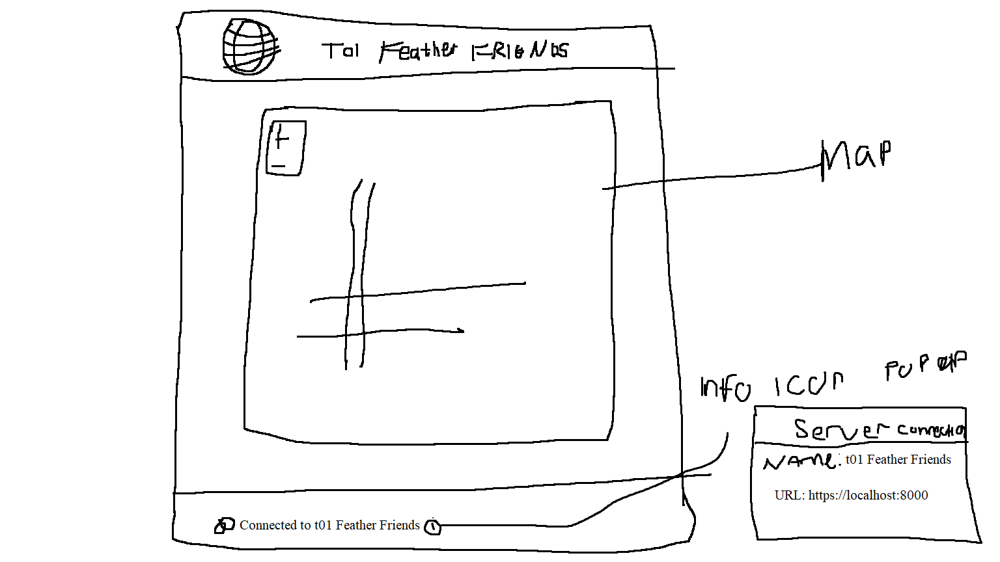
Much of the UI elements in the main page has stayed the same, we have just added minor tweaks.
In the header/footer we have added our team name (T01 Feather Friends). In the footer we have
also added a clickable icon that pulls up server information in a pop up. Much like described above,
the user can click on the team name and that will then show our about page.
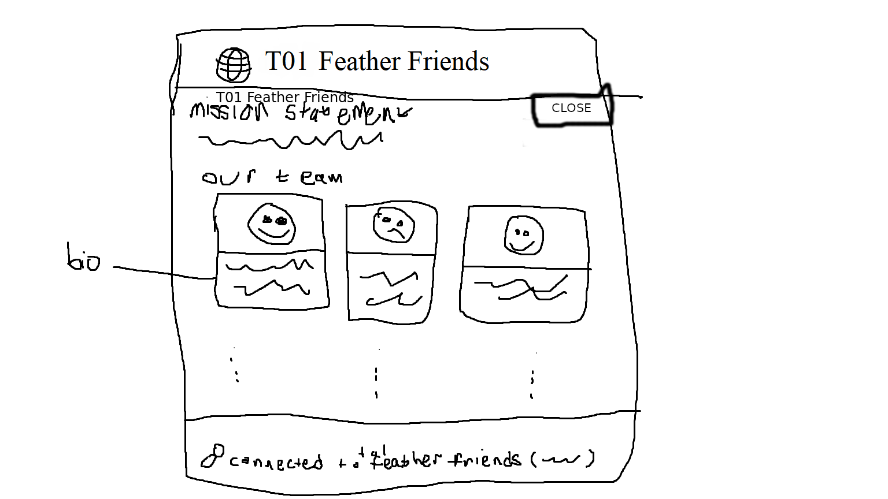
In our about page our team name(T01 Feather Friends) will be visble in the header/footer and in a heading.
Below that will be our Mission Statement. Below our mission statement there will be 5 cards containing a
picture and a short bio for each team mate. Our pictures will be the same size so they will all line up
neatly. In the top right of the page there will be a close button that will collapse the page back into 
the initial page that show the map.
# Sprint 2
#### User Interface
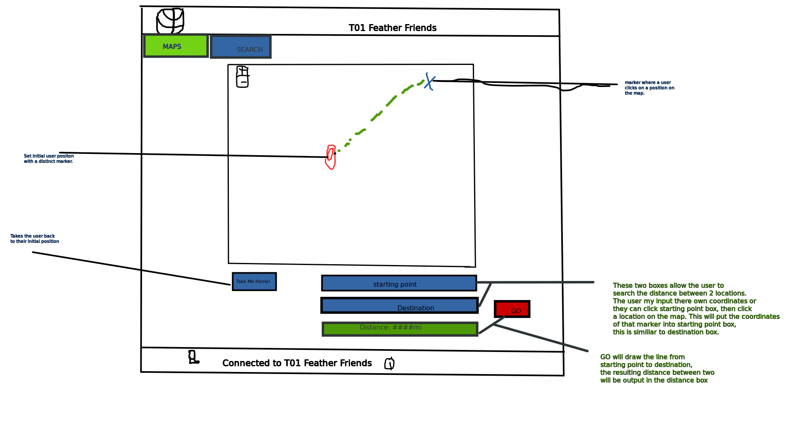
Starting point/Destination Boxes: The user can input their
own coordinates or they can first click on the box and then click on somewhere 
on the map, this will put the coordinates into the box for them.

GO Button - This will initiate the findDistance routine. The map will then draw a line from
starting point to destination.

Distance Ouput box - This will show the assocaited distance between starting point and 
destination. 

Take me home (center) button - If the user strays away from their initial 
position to this button will take them back.

#### User Interface - Search Tab
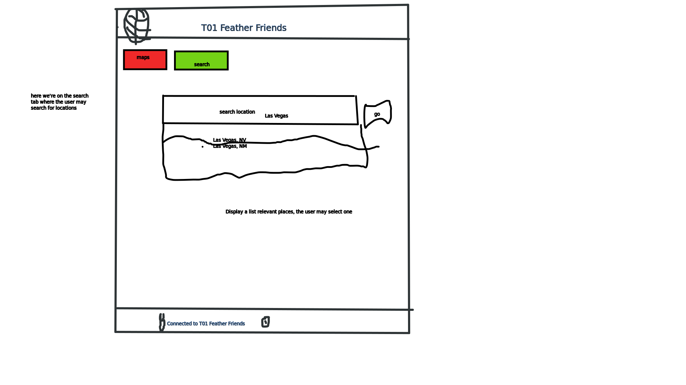
Clicking on the search tab will bring the user to the
search page. The user may enter a location they are looking
for into the search box. Relevant locations will appear below the search box. 
The user may pick one to search for. 

#### Class Diagram
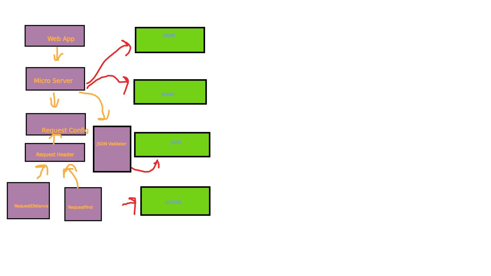
The classes in purple represent the classes specific to this application.  
* WebApplication processes command line parameters and creates MicroServer.
* MicroServer start a web server on the given port, configures the server for security, static files, and APIs for different types of requests, and processes the requests as they arrive.
* JSONValidator verifies a request is properly formatted before attempting to process it using JSON Schemas.
* RequestConfig is a specific request that allows the server to respond with its configuration to allow interoperability between clients and servers. 
* RequestHeader defines the basic components of all requests.
* RequestDistance responds to the clients request with a calculated distance
* RequestFind handles find requests

The classes in green represent the external libraries used by the application.
Often there are several related classes but we've listed only one to simplify the diagram.
* GSON converts a JSON string into a Java object instance.
* Spark provides the necessary web support for our MicroServer.
* JSON provides libraries to manipulate JSON objects using the JSON Schema libraries.
* Logger provides a centralized logging facility used in all of the application classes.

#### Component Diagram
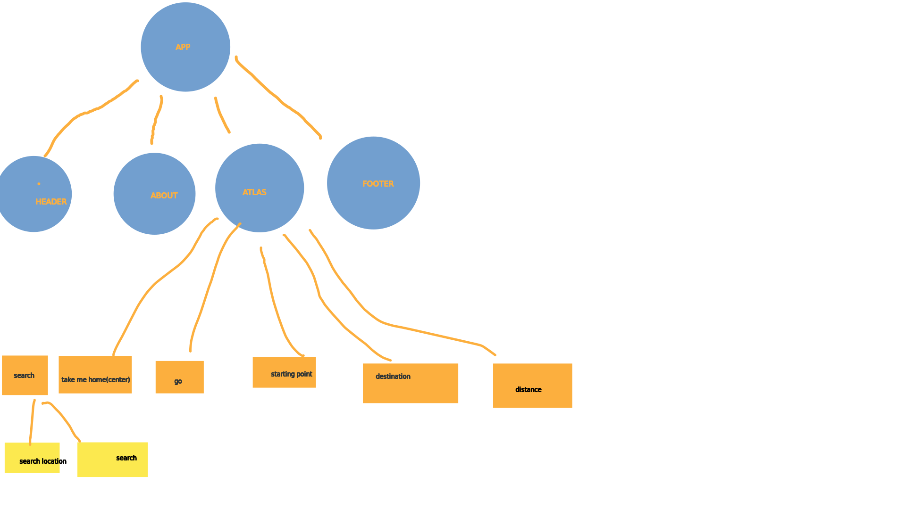
The component hierarchy for the base application depicted below shows the our top level App component with four children components.
* App renders the major components on the screen.
* Header renders an icon and a team name in the top banner.
* Footer renders the current server connection in the bottom footer.
* Atlas renders a map.
* About renders information about the team.
Atlas Children
* Search is a different tab of the atlas tab where the user can search for locations.
* Search uses state, it saves the user input, into search location.
* Take me home recenters the user to initial position
* Go initiates the line to to draw from point a to point b
* Starting point and destination hold state, it saves the user input
* distance is lifted when the search is complete and moved up to atlas

####
# Sprint 3

#### User Interface

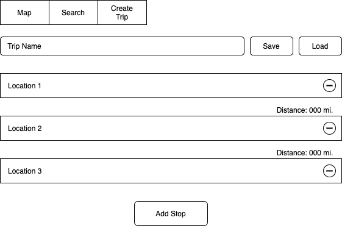

This interface will be created for the new 'Create Trip' tab in our application.
As shown in this diagram, there will be an input box at the top for the user to enter a name for their trip,
alongside buttons to save the trip and load other trips. Below this, there will be a list of the locations with
their distances from each other shown between them. Each location will have a subtraction icon that can be used
to remove them, and there will be a button at the bottom to add a new location.

#### Component Diagram

As before, our component heirarchy for the application shows a top level App component with 4 children.
* Header: renders an icon and a team name in the top banner.
* Footer: renders the current server connection in the bottom footer.
* Atlas: renders a map and has four children that extend the function of that map.
* About: renders information about the team.
Atlas Children
* Navigation: renders a tab system that allows the user to switch between different tabs to keep the UI clean.
* Search: renders a search bar that allows users to find places and then click on one to go to that location on the map.
* Distance Form: renders a form below the map that allows users to find the distance between two locations on the map.
* Create Trip: renders the trip management UI explained and shown in the above User Interface section.

#### Class Diagram

The classes in purple represent the classes specific to this application.  
* WebApplication processes command line parameters and creates MicroServer.
* MicroServer start a web server on the given port, configures the server for security, static files, and APIs for different types of requests, and processes the requests as they arrive.
* JSONValidator verifies a request is properly formatted before attempting to process it using JSON Schemas.
* RequestConfig is a specific request that allows the server to respond with its configuration to allow interoperability between clients and servers. 
* RequestHeader defines the basic components of all requests.
* RequestDistance responds to the clients request with a calculated distance
* RequestFind handles find requests
* RequestTrip responds to the client's request with a JSON trip.

The classes in green represent the external libraries used by the application.
Often there are several related classes but we've listed only one to simplify the diagram.
* GSON converts a JSON string into a Java object instance.
* Spark provides the necessary web support for our MicroServer.
* JSON provides libraries to manipulate JSON objects using the JSON Schema libraries.
* Logger provides a centralized logging facility used in all of the application classes.
# Sprint 4 

### User Interface

This user interface draws upon and builds from the last sprint.  
We have moved all of the controls for building a trip to the top
of the trip tab.  We have also improved the destinations so that 
each destination can be dragged and be opened to see more details.
We have also improved our distance functionality to be automatic and
be hidden / shown with the icon rather than having a collapse.
 
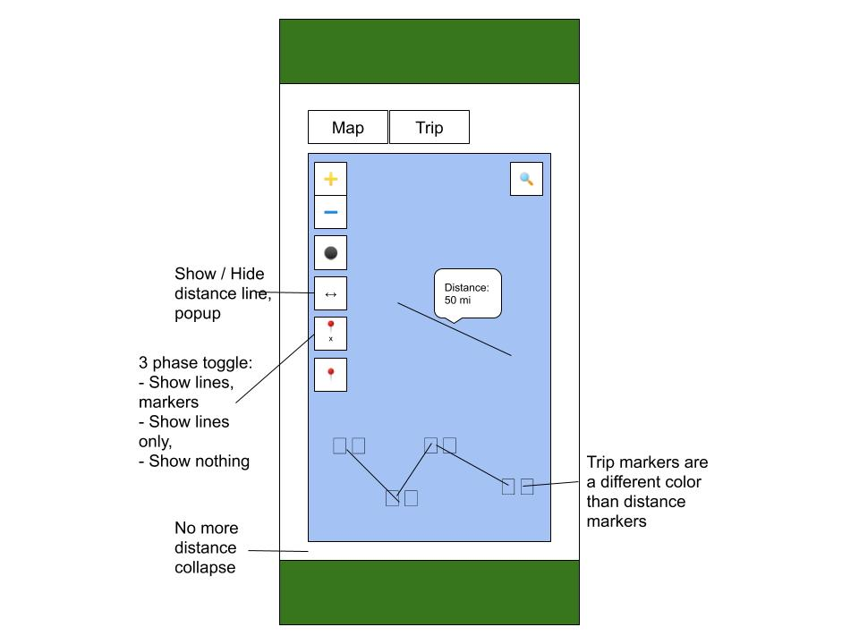
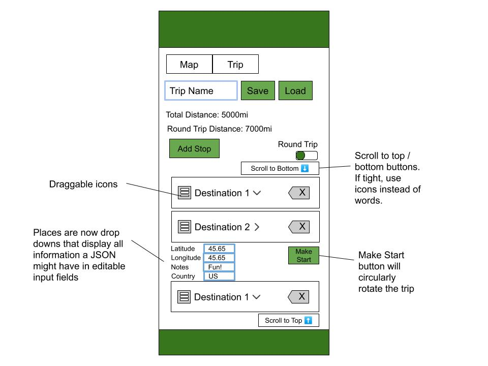

#### Component Diagram

Just as in sprint 3, our component heirarchy for the application shows a top level App component with 4 children.
* Header: renders an icon and a team name in the top banner.
* Footer: renders the current server connection in the bottom footer.
* Atlas: renders a map and has four children that extend the function of that map.
* About: renders information about the team.

Functionality for distance will now be hidden in existing UI, deprecating the collapse
we build in the previous sprints.  However, we will still keep the code in a separate
component so that we can separate distance logic out of our `Atlas.js`.

Atlas Children
* Navigation: renders a tab system that allows the user to switch between different tabs to keep the UI clean.
* Search: renders a search bar that allows users to find places and then click on one to go to that location on the map.
* Create Trip: renders the trip management UI explained and shown in the above User Interface section.

#### Class Diagram (same as Sprint 3)

The classes in purple represent the classes specific to this application.  
* WebApplication processes command line parameters and creates MicroServer.
* MicroServer start a web server on the given port, configures the server for security, static files, and APIs for different types of requests, and processes the requests as they arrive.
* JSONValidator verifies a request is properly formatted before attempting to process it using JSON Schemas.
* RequestConfig is a specific request that allows the server to respond with its configuration to allow interoperability between clients and servers. 
* RequestHeader defines the basic components of all requests.
* RequestDistance responds to the clients request with a calculated distance
* RequestFind handles find requests
* RequestTrip responds to the client's request with a JSON trip.

The classes in green represent the external libraries used by the application.
Often there are several related classes but we've listed only one to simplify the diagram.
* GSON converts a JSON string into a Java object instance.
* Spark provides the necessary web support for our MicroServer.
* JSON provides libraries to manipulate JSON objects using the JSON Schema libraries.
* Logger provides a centralized logging facility used in all of the application classes.

# Sprint 5

### User Interface

This user interface draws upon and builds from the last sprint.  
We now have a settings tab for changing settings on the map such as marker style, line style, and distance unit type. All of these attributes are in a dropdown menu.

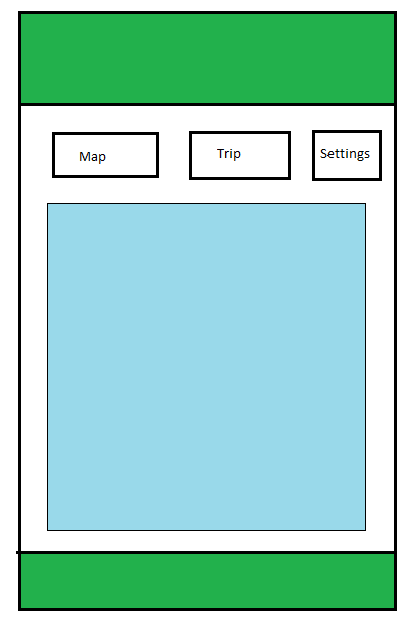
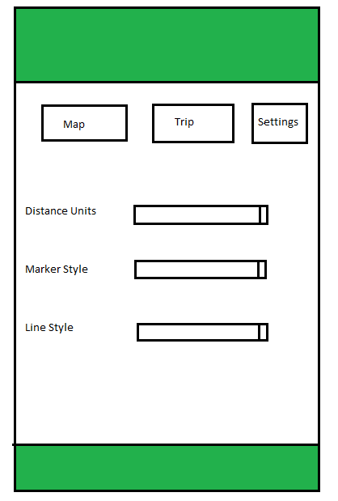

Our serach will now also be able to open an advanced search module that allows for the user to input more information than just a name for searching. This will include city, country, and region.

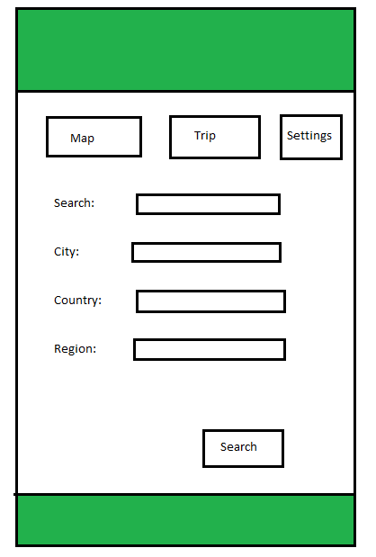

Save on our Trip tab now will open a module that allows the user to input the file name as well as a dropdown for different file formats.

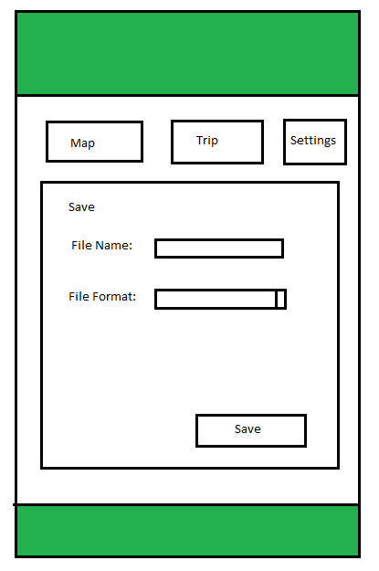

#### Component Diagram

Just as in sprint 4, our component heirarchy for the application shows a top level App component with 4 children.
* Header: renders an icon and a team name in the top banner.
* Footer: renders the current server connection in the bottom footer.
* Atlas: renders a map and has four children that extend the function of that map.
* About: renders information about the team.

Functionality for distance will now be hidden in existing UI, deprecating the collapse
we build in the previous sprints.  However, we will still keep the code in a separate
component so that we can separate distance logic out of our `Atlas.js`.

Atlas Children
* Navigation: renders a tab system that allows the user to switch between different tabs to keep the UI clean.
* Search: renders a search bar that allows users to find places and then click on one to go to that location on the map.
* Create Trip: renders the trip management UI explained and shown in the above User Interface section.

#### Class Diagram (same as Sprint 4)

The classes in purple represent the classes specific to this application.  
* WebApplication processes command line parameters and creates MicroServer.
* MicroServer start a web server on the given port, configures the server for security, static files, and APIs for different types of requests, and processes the requests as they arrive.
* JSONValidator verifies a request is properly formatted before attempting to process it using JSON Schemas.
* RequestConfig is a specific request that allows the server to respond with its configuration to allow interoperability between clients and servers. 
* RequestHeader defines the basic components of all requests.
* RequestDistance responds to the clients request with a calculated distance
* RequestFind handles find requests
* RequestTrip responds to the client's request with a JSON trip.

The classes in green represent the external libraries used by the application.
Often there are several related classes but we've listed only one to simplify the diagram.
* GSON converts a JSON string into a Java object instance.
* Spark provides the necessary web support for our MicroServer.
* JSON provides libraries to manipulate JSON objects using the JSON Schema libraries.
* Logger provides a centralized logging facility used in all of the application classes.